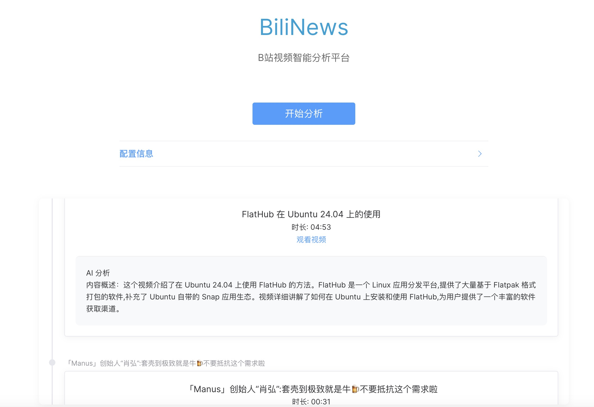

# BiliNews - B站视频智能分析平台




BiliNews 是一个基于 B 站视频内容的智能分析平台，能够自动获取 UP 主的视频动态，并使用 AI 技术对视频内容进行智能分析和总结。

## 功能特点
- 🎯 自动获取自己的 UP 主视频动态
- 🤖 AI 智能分析视频内容
- 🚀 实时分析和展示

## 架构逻辑
通过b站api获取个人视频信息，langchain传递给llm进行分析，前端通过api获取展示结果

## 技术栈

### 前端
- Vue 3
- Element Plus
- TypeScript
- Vite

### 后端
- FastAPI
- Python
- Redis
- LangChain
- OpenRouter API

## 快速开始

### 克隆项目
```bash
git clone https://github.com/ZHLOVEYY/biliNews.git
cd biliNews
```
### 运行启动指令
- 后端 （项目文件夹下运行）
`uvicorn backend.api.main:app --reload`

- 前端 （frontend文件夹下运行）
`npm run dev`

接着http://localhost:5173/ 即可访问前端页面 

- 缓存清理方法
```bash
	redis-cli
	\> FLUSHALL
``` 
- 安装,依赖（缺啥补啥）：
vue相关 langchain相关 redis相关 FASTAPI相关

### 测试文件夹test_not_in_project
里面testapi文件夹中有自己的b站api获取测试的代码 运行example.py就行

### 需要填入的数据
- b站uid
进入b站个人主页，网页后数字就是自己的id
- openRouter API key
自行官网进行api注册，在llm_service.py中默认使用deepseek v3 免费模型，网页中填入就可以使用 （deepseek v3似乎每天可以免费用200次，claude haiku一次获取2页30条数据分析大约花费4分RMB）
- cookie
登陆自己的b站后F12，更新页面，随便一条请求打开请求头，复制自己的cookie
（没有bili Auth 只能这样操作才能获取自己的api信息）

## 项目改进方向(很多)
- 俺先修炼下技术 
- 优化前端UI，提供更多选项
- 优化langchain分析，包括来源，分析结果统计，增加功能（比如模型选择等）
- 优化后端组织部署
